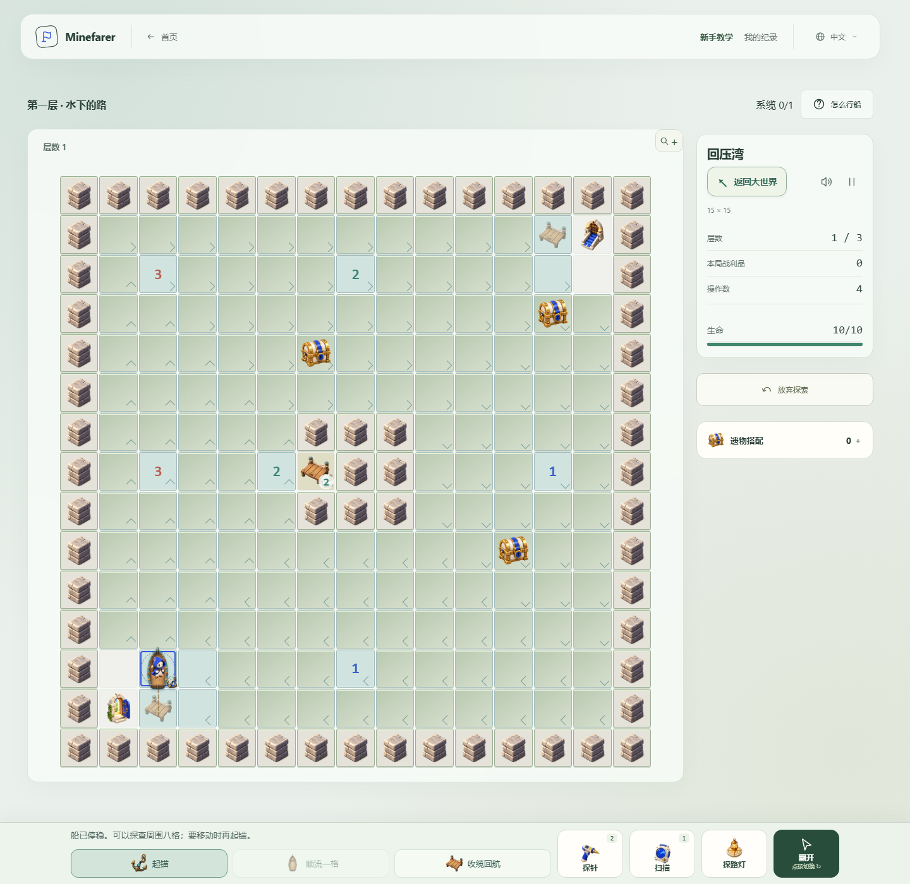

# Chapter Two, stage two: Pressure Cove

Pressure Cove replaces the former ferry-between-stops design with three authored water minefields. Old Ferry remains the physical campaign entry. Players identify safe water, choose a route through currents and secure island moorings before docking at the exit.

## Sailing and deduction

- **Board at a dock.** The boat has its own position; the character cannot walk over water without it.
- **Lower the anchor to sound nearby water.** The eight surrounding cells are within reach. Their clues count neighboring mines exactly as in ordinary Minesweeper. Sounding a cell does not move the boat, collect a chest or count as travel. A mistaken sounding resolves normal expedition mine damage.
- **Raise the anchor to sail.** Click discovered safe water to follow a real navigable route. Currents allow downstream movement and sideways paddling, so islands and changes in current matter. Direct upstream movement is blocked. The drift button advances one already discovered downstream cell; it provides no new information.
- **Secure a mooring.** Stop beside it, lower the anchor and click its illustrated bollard. Each secured mooring adds a return point along the rope already paid out behind the boat.
- **Haul back when a branch is unsuitable.** Follow the recorded rope to the previous return point. Repeated hauling can return through earlier points to the departure dock. This preserves discoveries and flags without revealing new tiles or granting repeat travel rewards.

Mines and numbers stay fixed during this mechanic. Tidal rearrangement belongs to Reed Channels and its separate Recollection family. Profession tools remain available, while movement skills cannot abandon the hull in the middle of the river.

## Authored crossings

| Crossing                  | Board   | Mines | Moorings | Focus                                                 |
| ------------------------- | ------- | ----- | -------- | ----------------------------------------------------- |
| Water beneath the path    | 15 × 15 | 26    | 1        | Sounding and the first current circuit                |
| Around the divided island | 17 × 17 | 38    | 2        | Choosing branches and returning to a mooring          |
| Leave a return line       | 19 × 19 | 51    | 3        | Connecting several routes without losing the way back |

Every crossing has three optional chests. They must be physically reached. The exit opens after all moorings are secured; merely discovering its tile does not finish the floor. The authored charts have accepted-action walkthroughs using public clues, including raising/lowering the anchor and actual navigation. These walkthroughs demonstrate completion, not a measured playtime or a guarantee that the stage cannot be simplified by a skilled player.

## Presentation

The generated wooden skiff sits below the existing profession sprite in one moving layer. Boarding, sailing along intermediate cells, hauling, dropping the anchor and securing a mooring have dedicated performances. Reduced motion commits the same actions immediately. The generated pier and existing anchor image replace text symbols both on the board and on the large bottom-dock controls.

The first crossing attaches a boarding card to the scene, then moves contextual guidance into the bottom dock once aboard. The existing help dialog has four short illustrated steps. All instructions, accessible labels and current directions are translated into English, Chinese and Japanese. See [the sprites and exact prompts](river-artwork.md).

[Mobile view](images/river-navigation-mobile.png).

## Recollection

Clearing **Reed Channels** unlocks **Tidal sluices**; clearing **Pressure Cove** unlocks **River navigation**. Unlocks belong to the shared camp and are checked at departure. Neither family uses campaign rows or a fixed campaign seed.

River generation varies terrain, mines, currents, endpoints, mooring count and locations. It retains the selected difficulty's exact mine budget and three treasures. Safe cells outside the directed sailing component become banks; every objective is reachable. The tidal family generates its own power graph and variable moving strips, with connectivity preserved through switch changes. See [generation invariants and audit instructions](recollection-randomness.md).

## Persistence and validation

`pressure-cove-v3` retires unfinished v1/v2 campaign attempts instead of replaying obsolete rules. Permanent chapter completion, equipment, supplies and previously settled rewards remain. No old ferry engine is retained.

Regression coverage includes public-clue campaign completion, per-action save replay, chapter-gated Recollection choices, generated exploration completion and boss entry without leftover river/tide state. Separate browser checks exercise boarding, illustrated help, navigation, anchoring, moorings and stacking at 320, 390, 1440 and 3840 pixels, including all three translations and reduced motion.
