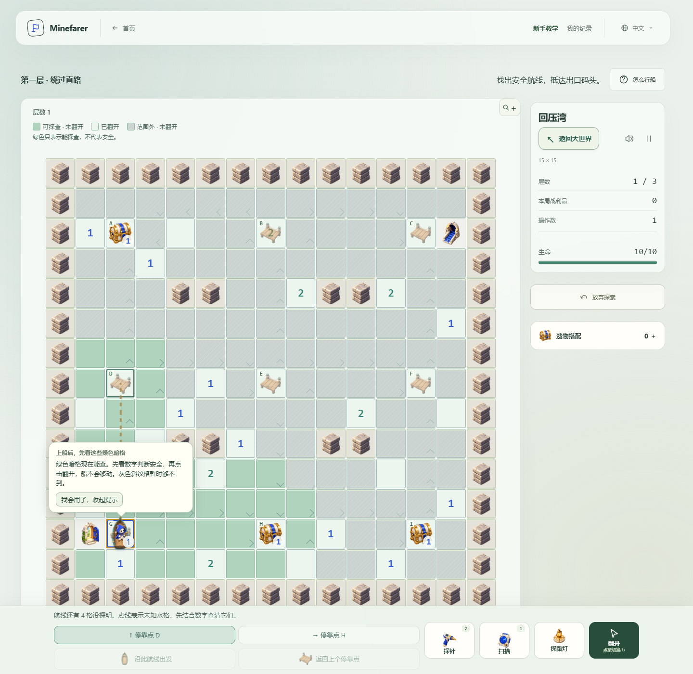

# Chapter Two, stage two: Pressure Cove

Pressure Cove is a route-planning crossing. The boat leaves a berth, follows the public current arrows through a complete reach, and stops at the next berth. There is no manual anchor toggle, one-cell drift action or required mooring checklist.

## Reading and sailing

1. Board at the departure pier. The boat and passenger remain one moving unit.
2. Select a direction in the bottom dock. Preview the entire route and its destination. Solid segments are revealed water; dashed segments are unknown. Flags block departure regardless of whether the player's hypothesis is correct. Preview never inspects hidden mines.
3. Use the ordinary numbers, flags, quick-open and profession tools to check the route. From a berth, soundings reach its outgoing channels and their immediate banks. They reveal information without moving the boat or collecting distant treasure.
4. Once every route cell is revealed and unflagged, launch. The boat follows all turns and cannot stop between berths. Ordinary walking cannot bypass this rule, even over fully revealed water.
5. Choose another branch or return along the last sailed reach. Backtracking preserves discoveries and never grants duplicate treasure or travel credit. Reach the exit pier to finish; optional berths and chests need not all be visited.

Mines and numbers stay fixed. The continuous trip changes where the next decision can be made; it does not shuffle the board as Reed Channels does.

## Three authored charts

| Crossing            | Board   | Mines | Berths | Route decisions                                                                                                  |
| ------------------- | ------- | ----: | -----: | ---------------------------------------------------------------------------------------------------------------- |
| Beyond the shortcut | 15 × 15 |    26 |      9 | Identify blocked direct reaches, follow a bend and choose whether to visit the lower treasure branch.            |
| Choose a branch     | 17 × 17 |    38 |     12 | Cross between channels after a blocked shortcut; choose the shorter exit branch or an optional treasure circuit. |
| Connected bends     | 19 × 19 |    51 |     16 | Combine several reaches, compare two exit routes and use safe returns for optional side branches.                |

Each chart has three optional chests. The second and third charts rotate their geography, including clues and current arrows, so departure and exit are not always at the same corner. Islands separate reaches. The shared builder receives authored network edges, fixed seeds and mine budgets; these campaign charts remain deterministic.

## Interface

The board labels berths with letters, draws the selected whole route and highlights its destination. Selecting a route is presentation only; the separate departure button commits it, including on touch devices. An uncleared route keeps that button disabled and explains the remaining unknown water or flags. Green covered water is within sounding reach, pale water is revealed, and gray hatched covered water is out of reach. A board legend explains that green indicates reach, not safety; the fills and accessible labels follow the same geometry as legal reveals.

The existing boat and pier art are retained. Boat and passenger animate through every intermediate square, and input remains locked during the committed voyage. Reduced motion uses the same accepted action immediately. The first boarding hint remains attached to the boat, then teaches surveyable cells after boarding. It can be dismissed, and accepted surveys end the introduction across reloads. Out-of-range and flagged clicks receive specific feedback. The illustrated guide and all three language catalogs describe the rules.

[Touch preview](images/river-routes-mobile.png).

## Recollection and saves

Clearing Pressure Cove still unlocks River navigation. Recollection builds a fresh directed berth network with a safe spanning tree and hazardous alternative reaches, seed-dependent mines, different endpoints and three reachable chests. It does not reuse campaign charts. The chosen difficulty's exact mine budget is retained.

`pressure-cove-v4` replaces v1–v3. Expedition rules revision **16** retires prior active journals at the persistence boundary, banking their valid extraction checkpoint once. This also covers a campaign journal whose content ID is unchanged but whose shared rules revision is old. Camp ownership, currency, completed stages and already granted rewards remain intact; no old anchor engine is retained.

## Validation and playtest status

Automated checks cover public-clue completion of all three charts, real turns and multi-cell voyages, inability to walk through channels, preview privacy, optional treasure settlement, backtracking, per-action replay, old-journal retirement and generated network connectivity. Browser checks cover preview-before-departure, unknown-route gating, the single animated passenger, input locking, returns, narrow viewports and three languages.

These checks establish rule correctness and completion paths. Human acceptance of the redesigned gameplay is still pending.
